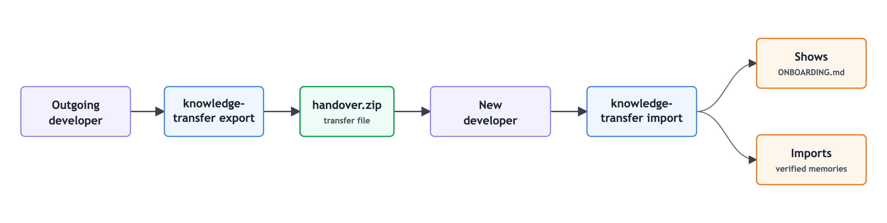

<div align="center">

# knowledge-transfer

**Project handover for Claude Code and Codex.**

Export a short onboarding guide and privacy-filtered AI memories as a zip; import only memories verified against the current code.

[](LICENSE)
[](https://claude.com/claude-code)
[](#project-status)

</div>

---



## Why This Exists

When a developer leaves a project, two kinds of knowledge leave with them:

| Knowledge | What usually happens |
|---|---|
| Human context | The next person gets scattered docs, stale notes, or a rushed call. |
| AI context | The assistant starts from zero, even if another assistant learned the project over months of sessions. |

`knowledge-transfer` packages both into `handover.zip`: a short human onboarding
document plus portable AI memories that are filtered on export and verified on
import.

## How It Works

| Phase | Who runs it | What happens |
|---|---|---|
| `export` | The colleague leaving | Analyzes the project, reads project-scoped memories, filters private content, writes `handover/` and `handover.zip`. |
| `import` | The colleague joining | Reads the onboarding doc, verifies each memory against the current code, installs only the valid project knowledge. |

Run without arguments, the skill detects the phase:

- `handover/manifest.json` or `handover.zip` exists -> import
- no `handover/` package -> export

## Install

### Claude Code

From inside Claude Code:

```text
/plugin marketplace add ferdinandobons/knowledge-transfer
/plugin install knowledge-transfer@knowledge-transfer
/reload-plugins
```

Plugin-installed skills are namespaced:

```text
/knowledge-transfer:knowledge-transfer export
/knowledge-transfer:knowledge-transfer import
```

### Codex

From your terminal:

```bash
codex plugin marketplace add ferdinandobons/knowledge-transfer --ref main
codex plugin add knowledge-transfer@knowledge-transfer
```

Start a new Codex thread, then invoke the plugin:

```text
@knowledge-transfer export
@knowledge-transfer import
```

### Raw Skill

Agents that only read raw `SKILL.md` folders can use this repo's `SKILL.md` plus
`references/` in a clean skill directory. Prefer the plugin install above for
Claude Code and Codex.

## Quick Start

Leaving a project:

```text
/knowledge-transfer:knowledge-transfer export
```

In Codex:

```text
@knowledge-transfer export
```

Review the proposed package, including the exclusion report, then send
`handover.zip` to the next colleague.

Joining a project:

Place `handover.zip` in the project root, then run:

```text
/knowledge-transfer:knowledge-transfer import
```

In Codex:

```text
@knowledge-transfer import
```

Read the onboarding doc first. The accepted memories are then installed through
the current agent's memory mechanism; stale memories are fixed when obvious or
discarded with a reason.

## What Gets Created

```text
handover.zip              # transfer this file
handover/                 # local staging folder used to build the zip
  ONBOARDING.md     # 600-1000 words, non-technical project map
  memories/         # neutral, portable project memories
  manifest.json     # export date, commit SHA, exported/excluded counts
```

| File | Purpose |
|---|---|
| `ONBOARDING.md` | A first-read project map: what it is, main pieces, key flows, where to start, gotchas. |
| `memories/*.md` | Project facts, conventions, decisions, fragile flows, and commands worth preserving. |
| `manifest.json` | Package version, export commit, language, and privacy-filter accounting. |
| `handover.zip` | The transfer artifact to pass to the next person. It contains the full `handover/` folder. |

## Guarantees

| Guarantee | How the skill enforces it |
|---|---|
| No personal memory export | `type: user` memories are never written to the package. |
| Neutral project voice | Exported memories are rewritten without names, emails, usernames, or personal framing. |
| Transferable handoff | The output is a zip archive containing plain Markdown/JSON. |
| Verified import | Every cited file, path, or identifier is checked against the current repo before installation. |
| No blind overwrite | Existing memories are not overwritten silently on import. |

## What Are AI Memories?

AI memories are durable notes an assistant builds while working with a developer
across many sessions. They are not a chat transcript. They are compressed project
knowledge that stays useful later: architecture decisions, local conventions,
fragile flows, commands that actually work, files to avoid touching casually, and
the reasons behind choices that may never have reached the README.

Over time, those memories become part of the project's working context. Some are
captured deliberately; others emerge indirectly from repeated fixes, reviews, and
debugging sessions. Losing them and starting from zero means losing the context a
colleague built while doing the work, including the project understanding their AI
learned alongside them.

## Why Not Just Ask The AI?

You can clone an unknown repo and ask an AI to explain it. The answer starts from
whatever is visible in the code today.

`knowledge-transfer` flips the order: the outgoing context is packaged first,
privacy-filtered, transferred, then verified before the next assistant learns it.
The newcomer gets a short human map and an AI that already knows the project's
important constraints.

## Project Status

**Beta.** The skill is prompt-driven and validated with the manual checklist in
[TESTING.md](TESTING.md). The package format is versioned through
`manifest.version`, so future import behavior can stay backward compatible.

Claude Code marketplace metadata lives in `.claude-plugin/` and points to the
self-contained plugin in `plugins/knowledge-transfer/`. That plugin directory
also contains the Codex marketplace package, with real files rather than
symlinks so installed plugin caches are self-contained.

## License

[MIT](LICENSE) (c) 2026 Ferdinando Bonsegna
